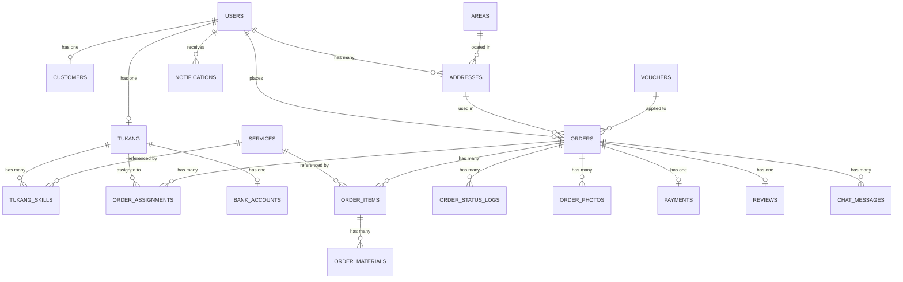

# Database ERD — GoKang Clone v2

> **Update 2026-04-19**: Schema direvisi setelah analisis screenshot app GoKang asli.
> Perubahan utama: Order sekarang multi-item (support multi-tukang + multi-session + multi-day).

Database: **MySQL 8.0**
Naming convention: `snake_case`, plural untuk tabel
All tables have: `id` (bigint auto-increment PK), `created_at`, `updated_at`
Most tables have: `deleted_at` (soft delete)

---

## 🔄 Changes from v1

| Area | v1 (lama) | v2 (baru) |
|------|-----------|-----------|
| Order structure | 1 order = 1 service + 1 duration | 1 order = banyak `order_items` (beda service, sesi, tanggal) |
| Service pricing | `price_full_day`, `price_half_day` | `price_full_day`, `price_morning`, `price_afternoon` |
| Duration | enum: half_day / full_day | session-based per item |
| Multi-day | Tidak didukung | Didukung (start_date + end_date per item) |
| Terms & Conditions | Tidak ada | `orders.terms_accepted_at` |
| Biaya tambahan | Tidak ada | `orders.extra_fee_parking` |
| Postal code alamat | Tidak ada | `addresses.postal_code`, `addresses.address_note` |
| Order timer | Tidak ada | `payments.expires_at` (1 jam default) |

---

## Entity Relationship Diagram



---

## Table Definitions

### Tables yang TIDAK berubah dari v1

- `users`, `customers`, `tukang`
- `tukang_skills`, `tukang_documents`, `bank_accounts`, `tukang_service_areas`
- `order_status_logs`, `order_photos`
- `reviews`, `chat_messages`, `notifications`
- `surveys`, `vouchers`, `voucher_usages`, `payouts`
- `banners`, `articles`, `app_settings`, `otp_verifications`
- `areas`, `personal_access_tokens`

---

### 🔄 `services` — UPDATED
Tarif 3 sesi per hari (dari screenshot Image 2).

| Column | Type | Description |
|--------|------|-------------|
| id | bigint PK | |
| code | varchar(50) | Unique |
| name | varchar(100) | |
| slug | varchar(100) | Unique |
| description | text | |
| icon_url | varchar(255) | |
| **price_full_day** | decimal(10,2) | Seharian 08:00-17:00 (e.g., 259000) |
| **price_morning** | decimal(10,2) | Pagi 08:00-12:00 (e.g., 199000) |
| **price_afternoon** | decimal(10,2) | Sore 13:00-17:00 (e.g., 199000) |
| service_type | enum | daily, consultant |
| is_active | boolean | |
| sort_order | int | |

---

### 🔄 `addresses` — UPDATED

Ditambah 2 kolom (dari Image 8):

| New Column | Type | Description |
|------------|------|-------------|
| address_note | varchar(255) nullable | Patokan / detail |
| postal_code | varchar(10) nullable | Kode pos |

---

### 🔄 `orders` — UPDATED BESAR

Kolom `service_id`, `duration`, `quantity` **DIHAPUS** (pindah ke `order_items`).

| Column | Type | Description |
|--------|------|-------------|
| id | bigint PK | |
| order_code | varchar(30) unique | KNG-2026-0001 |
| customer_id | bigint FK | |
| order_type | enum | daily_tukang, daily_with_material, borongan_home, borongan_business |
| address_id | bigint FK | |
| problem_description | text nullable | "Deskripsikan masalah" |
| status | enum | draft, pending_payment, paid, searching_tukang, assigned, in_progress, completed, cancelled, refunded |
| subtotal | decimal(12,2) | Sum dari order_items |
| material_cost | decimal(12,2) | |
| **extra_fee_parking** | decimal(10,2) | Default 0 |
| extra_fee_others | decimal(10,2) | Default 0 |
| voucher_id | bigint FK nullable | |
| discount_amount | decimal(12,2) | |
| total | decimal(12,2) | |
| platform_fee | decimal(12,2) | |
| **terms_accepted_at** | timestamp nullable | Saat user centang T&C |
| started_at, completed_at, cancelled_at | timestamp | |
| cancel_reason | text | |
| cancelled_by | enum | customer, tukang, system, admin |

---

### 🆕 `order_items` — NEW TABLE

Inti perubahan. 1 order punya banyak items (beda service/sesi/tanggal).

| Column | Type | Description |
|--------|------|-------------|
| id | bigint PK | |
| order_id | bigint FK | Cascade delete |
| service_id | bigint FK | Jagoan apa |
| quantity | int | Jumlah tukang (default 1) |
| start_date | date | Tanggal mulai |
| end_date | date | Tanggal selesai |
| total_days | int | end-start+1 |
| session | enum | morning, afternoon, full_day |
| price_per_session | decimal(10,2) | Snapshot harga |
| subtotal | decimal(12,2) | price × quantity × total_days |
| include_material | boolean | Default false |
| notes | text nullable | |

**Contoh kasus:**
```
Order #KNG-2026-0042:
├── Item 1: Jagoan Cat × 2, 30 Mei - 1 Jun, morning,   Rp 199.000
└── Item 2: Jagoan Listrik × 1, 30 Mei, afternoon,     Rp 199.000

Subtotal item 1 = 199.000 × 2 × 3 = Rp 1.194.000
Subtotal item 2 = 199.000 × 1 × 1 = Rp 199.000
Order subtotal  = Rp 1.393.000
```

---

### 🆕 `order_assignments` — NEW TABLE

Tracking assignment tukang per item (karena 1 order bisa multiple tukang).

| Column | Type | Description |
|--------|------|-------------|
| id | bigint PK | |
| order_id | bigint FK | |
| order_item_id | bigint FK | Item mana |
| tukang_id | bigint FK nullable | Yang accept (null saat broadcast) |
| status | enum | broadcasting, offered, accepted, rejected, cancelled |
| offered_at | timestamp | |
| responded_at | timestamp | |
| assignment_round | int | Round ke-berapa |

---

### 🔄 `order_materials` — UPDATED

Reference ke `order_item_id` (bukan `order_id`).

| Column | Type | Description |
|--------|------|-------------|
| id | bigint PK | |
| **order_item_id** | bigint FK | Changed |
| item_name | varchar(100) | |
| quantity, unit, price_per_unit, subtotal | - | |
| receipt_photo | varchar(255) | |
| status | enum | pending_approval, approved, rejected |

---

### 🔄 `payments` — UPDATED

Field `expires_at` now default to `now() + 1 hour` (sesuai timer di Image 16).

---

## Seeding Changes

### services — 17 Jagoan
Tambah `price_morning` dan `price_afternoon`. Di GoKang asli, pagi = sore (sama harganya), jadi seeder tinggal copy:

```php
'price_full_day'  => 259000,
'price_morning'   => 199000,
'price_afternoon' => 199000,
```

### app_settings — tambah
```
payment_timer_minutes = 60
order_session_morning_start = 08:00
order_session_morning_end = 12:00
order_session_afternoon_start = 13:00
order_session_afternoon_end = 17:00
```

---

## Migration Plan

Database belum ada data, jadi lebih clean **edit migrations existing**, bukan buat migration tambahan.

**Migrations yang perlu diedit:**
1. `2026_01_01_000004_create_services_table.php` — ganti price columns
2. `2026_01_01_000008_create_addresses_table.php` — tambah postal_code, address_note
3. `2026_01_01_000009_create_orders_table.php` — rombak total, + order_items + order_assignments
4. `2026_01_01_000010_create_transaction_related_tables.php` — update payments

**Last updated:** 2026-04-19 | **Version:** 2.0.0
